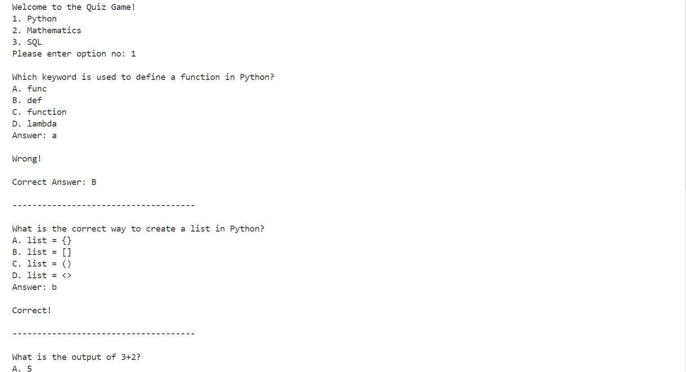
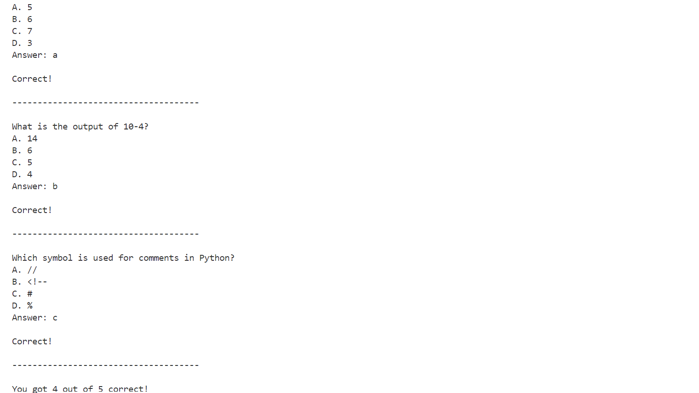

<<<<<<< HEAD
# 🎯 Quiz Game | Python Command-Line Project

An interactive and fun command-line **Quiz Game** developed using Core Python. This project helps strengthen Python basics, data structures, loops, and file handling skills.

---

 

---

## 📋 Table of Contents
- [Project Overview](#-project-overview)
- [Features](#-features)
- [Concepts Covered](#-concepts-covered)
- [Installation](#-installation)
- [How to Play](#-how-to-play)
- [Screenshots](#-screenshots)
- [Future Enhancements](#-future-enhancements)
- [Author](#-author)
- [License](#-license)

---

## 📚 Project Overview

This project is a **Quiz Game** where players answer multiple-choice questions from different categories.  
It runs on the command line using **pure Core Python**.

Key Objectives:
- Strengthen Core Python concepts
- Practice logic building and control flow
- Work with data structures and file handling

---

## 🚀 Features

✅ Display questions one by one  
✅ Accept user input (A/B/C/D)  
✅ Shuffle questions randomly each time  
✅ Validate input using `isalpha()`  
✅ Track and display score at the end  
✅ Show correct answers for review  
✅ Support multiple categories: **Python**, **Mathematics**, **SQL**  
✅ Fetch quizzes from an external `.csv` file

---

## 🧠 Concepts Covered

- Variables, Input/Output
- String methods
- Lists, Dictionaries
- Conditional Statements (if-else)
- Loops (for, while)
- Membership Operator (`in`)
- File handling with CSV

---

## ⚙️ Installation

```bash
# Clone the repository
git clone https://github.com/aayantasneem/quiz-game-python.git

# Navigate to the project directory
cd quiz-game-python

# Run the application
python quiz_game.py
```

---

## 🎮 How to Play

1. Open terminal/command prompt.
2. Run the Python script `quiz_game.py`.
3. Choose a quiz category (e.g., Python, Math, SQL).
4. Answer each question by typing **A**, **B**, **C**, or **D**.
5. Immediate feedback is given for correct/wrong answers.
6. After all questions, your final score is displayed.
7. You can review correct answers to learn and improve.

---

## 📸 Screenshots

> 

> 

---

## 🚧 Future Enhancements

- Add a countdown timer for each question.
- Introduce difficulty levels: Easy, Medium, Hard.
- High score saving and leaderboard feature.
- Develop a GUI version using Tkinter.
- Save scores in DB/File

---

## ✨ Author

Developed with ❤️ by [M. Aayan Tasneem](https://github.com/aayantasneem)

> **LinkedIn**: [https://www.linkedin.com/in/muhammadaayantasneem](https://www.linkedin.com/in/muhammadaayantasneem)

---

## 📄 License

This project is licensed under the **MIT License**.  
See the [LICENSE](LICENSE) file for details.
=======
# quiz-game
An interactive quiz game developed using Core Python, focused on logic building and data structure skills.
>>>>>>> 7d08fd661002e3bbf407f3f3986457f002f9849d
